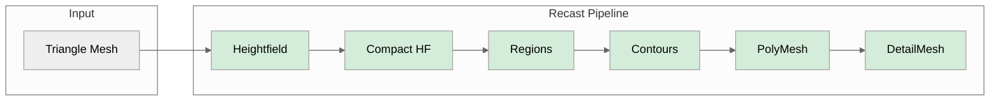

# recast-rs

A Rust port of [RecastNavigation](https://github.com/recastnavigation/recastnavigation).

[](LICENSE-MIT)
[](https://www.rust-lang.org)
[](https://webassembly.org/)

> **Note**: This port is developed for the [WoW Emulation project][wowemu] and
> has not been used outside of that context. The API may change as the project
> matures.

[wowemu]: https://github.com/wowemulation-dev

## Overview

This library provides navigation mesh generation and pathfinding for games.
It is a Rust 2024 edition port of Mikko Mononen's RecastNavigation C++ library.

## Port Accuracy

The Rust output is validated against the C++ RecastNavigation reference
implementation using identical parameters. The primary test mesh (nav_test.obj)
produces identical output at every pipeline stage including final polygon and
detail mesh counts.

### Pipeline Comparison



<sup>Green = exact match.</sup>

### Test Mesh Results

Tested with `cs=0.3 ch=0.2 walkable_height=2 walkable_climb=1 walkable_radius=1`.

#### nav_test.obj (884 vertices, 1612 triangles)

| Metric | Rust | C++ | Ratio |
|--------|------|-----|-------|
| Grid size | 305 x 258 | 305 x 258 | exact |
| Heightfield spans | 120,183 | 120,183 | exact |
| Walkable spans | 56,689 | 56,689 | exact |
| Regions | 147 | 147 | exact |
| Contours | 149 | 149 | exact |
| Polygons | 537 | 537 | exact |
| Polygon vertices | 1,197 | 1,197 | exact |
| Detail vertices | 2,228 | 2,228 | exact |
| Detail triangles | 1,172 | 1,172 | exact |

#### dungeon.obj (5101 vertices, 10133 triangles)

| Metric | Rust | C++ | Ratio |
|--------|------|-----|-------|
| Grid size | 248 x 330 | 248 x 330 | exact |
| Heightfield spans | 52,106 | 52,106 | exact |
| Regions | 36 | 37 | 0.97x |
| Contours | 37 | 37 | exact |
| Polygons | 216 | 217 | 0.995x |
| Polygon vertices | 452 | 452 | exact |
| Detail vertices | 874 | 868 | 1.007x |
| Detail triangles | 447 | 434 | 1.03x |

#### bridge.obj (29 vertices, 54 triangles)

| Metric | Rust | C++ | Ratio |
|--------|------|-----|-------|
| Grid size | 16 x 137 | 16 x 137 | exact |
| Polygons | 8 | 8 | exact |
| Polygon vertices | 18 | 18 | exact |
| Detail vertices | 32 | 32 | exact |
| Detail triangles | 16 | 16 | exact |

## Workspace Structure

| Crate | Description | WASM |
|-------|-------------|------|
| `recast-common` | Shared utilities, math, error types | Yes |
| `recast` | Navigation mesh generation | Yes |
| `detour` | Pathfinding and navigation queries | Yes |
| `detour-crowd` | Multi-agent crowd simulation | Yes |
| `detour-tilecache` | Dynamic obstacle management | Yes |
| `detour-dynamic` | Dynamic navmesh support | Yes |
| `recast-cli` | Command-line tool | No |

### Crate Dependencies

- **recast-common**: Base crate with no workspace dependencies
- **recast**: Depends on `recast-common`
- **detour**: Depends on `recast-common` and `recast`
- **detour-crowd**: Depends on `recast-common` and `detour`
- **detour-tilecache**: Depends on `recast-common`, `recast`, and `detour`
- **detour-dynamic**: Depends on `recast-common`, `recast`, `detour`, and `detour-tilecache`

## Features

### Recast - Navigation Mesh Generation

- Voxelization pipeline (heightfield, compact heightfield, contours, polygon mesh)
- Area marking with traversal costs
- Multi-tile mesh generation
- OBJ mesh loading

### Detour - Pathfinding

- A* pathfinding
- Funnel algorithm for path straightening
- Raycast for line-of-sight queries
- Spatial queries (nearest point, random point, polygon height)
- Off-mesh connections
- Multi-tile navigation

### DetourCrowd - Multi-Agent Simulation

- Agent management
- Collision avoidance
- Path following
- Proximity grid for spatial indexing

### DetourTileCache - Dynamic Obstacles

- Runtime obstacle management (cylinder, box, oriented box)
- Tile regeneration
- Compressed tile storage

## Usage

Add the crates you need to your `Cargo.toml`:

```toml
[dependencies]
recast = "0.1"
detour = "0.1"
detour-crowd = "0.1"  # Optional: crowd simulation
```

### Example

```rust
use recast::{RecastBuilder, RecastConfig};
use detour::{NavMesh, NavMeshQuery, QueryFilter};

// Build a navigation mesh
let config = RecastConfig::default();
let builder = RecastBuilder::new(config);
let (poly_mesh, detail_mesh) = builder.build_from_vertices(&vertices, &indices)?;

// Create a NavMesh for pathfinding
let nav_mesh = NavMesh::from_poly_mesh(&poly_mesh, &detail_mesh)?;

// Find a path
let mut query = NavMeshQuery::new(&nav_mesh);
let filter = QueryFilter::default();
let path = query.find_path(start_ref, end_ref, &start_pos, &end_pos, &filter)?;
```

## Building

```bash
# Build all crates
cargo build --workspace

# Run tests
cargo test --workspace

# Run benchmarks
cargo bench

# Build with optimizations
cargo build --release
```

### Performance Profiling

```bash
# Generate flamegraph for a binary
cargo flamegraph --bin recast-cli -- build mesh.obj output.bin

# Generate flamegraph for tests
cargo flamegraph-test --test integration_test

# Generate flamegraph for benchmarks
cargo flamegraph-bench --bench pathfinding
```

### Nextest Testing

```bash
# Run tests with nextest (faster parallel execution)
cargo nextest-all

# Run tests in release mode (faster test execution)
cargo nextest-release

# Run library tests only
cargo nextest-lib

# Run tests with custom profile
cargo nextest run --profile local --workspace
```

### Feature Flags

- `serialization` - Save/load navigation meshes
- `tokio` - Tokio runtime integration for `detour-dynamic` (not WASM-compatible)

### Platform Support

- Linux (x86_64, musl)
- macOS (x86_64, aarch64)
- Windows (x86_64)
- WebAssembly (wasm32-unknown-unknown)

## WebAssembly Support

All library crates support WebAssembly (`wasm32-unknown-unknown`). Build for WASM with:

```bash
cargo build --target wasm32-unknown-unknown -p recast -p detour
```

### WASM-Compatible Features

| Feature | Native | WASM | Notes |
|---------|--------|------|-------|
| Mesh generation | Yes | Yes | Full support |
| Pathfinding | Yes | Yes | Full support |
| Crowd simulation | Yes | Yes | Full support |
| Dynamic obstacles | Yes | Yes | Full support |
| Async operations | Yes | Yes | Runtime-agnostic via `async-lock` |
| File I/O | Yes | No | Use `std` feature to disable |
| Serialization | Yes | Yes | In-memory only on WASM |

### WASM Usage Notes

- **recast-common**: Disable file I/O with `default-features = false`
- **detour**: Serialization works with in-memory buffers
- **detour-tilecache**: Uses pure Rust LZ4 (`lz4_flex`)
- **detour-dynamic**: Async via `async-lock` and `futures-lite` (no tokio required)

## License

Dual-licensed under either:

- MIT License ([LICENSE-MIT](LICENSE-MIT))
- Apache License, Version 2.0 ([LICENSE-APACHE](LICENSE-APACHE))

## Acknowledgments

- Mikko Mononen for [RecastNavigation](https://github.com/recastnavigation/recastnavigation)
- [DotRecast](https://github.com/ikpil/DotRecast) for implementation reference
- [rerecast](https://github.com/janhohenheim/rerecast) for Rust patterns

## Resources

- [Original RecastNavigation](https://github.com/recastnavigation/recastnavigation)
- [Recast Navigation Documentation](https://recastnav.com/)
- [Digesting Duck Blog](http://digestingduck.blogspot.com/) - Navigation mesh concepts by Mikko Mononen
