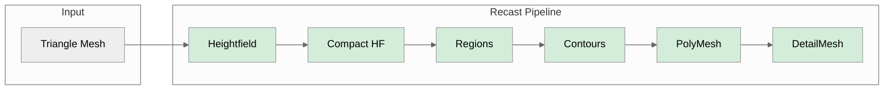

# recast-rs

A Rust port of [RecastNavigation](https://github.com/recastnavigation/recastnavigation).

<div align="center">

[](https://discord.gg/Jj4uWy3DGP)
[](https://github.com/sponsors/danielsreichenbach)
[](https://github.com/wowemulation-dev/recast-rs/actions)
[](https://webassembly.org/)
[](https://www.rust-lang.org)
[](LICENSE-APACHE)
[](LICENSE-MIT)

</div>

## Overview

This library provides navigation mesh generation and pathfinding for games.
It is a Rust 2024 edition port of Mikko Mononen's RecastNavigation C++ library.

## Port Accuracy

The Rust output is validated against the C++ RecastNavigation reference
implementation using identical parameters. The primary test mesh (nav_test.obj)
produces identical output at every pipeline stage including final polygon and
detail mesh counts.

### Pipeline Comparison



<sup>Green = exact match.</sup>

### Test Mesh Results

Tested with `cs=0.3 ch=0.2 walkable_height=2 walkable_climb=1 walkable_radius=1`.

#### nav_test.obj (884 vertices, 1612 triangles)

| Metric | Rust | C++ | Ratio |
|--------|------|-----|-------|
| Grid size | 305 x 258 | 305 x 258 | exact |
| Heightfield spans | 120,183 | 120,183 | exact |
| Walkable spans | 56,689 | 56,689 | exact |
| Regions | 147 | 147 | exact |
| Contours | 149 | 149 | exact |
| Polygons | 537 | 537 | exact |
| Polygon vertices | 1,197 | 1,197 | exact |
| Detail vertices | 2,228 | 2,228 | exact |
| Detail triangles | 1,172 | 1,172 | exact |

#### dungeon.obj (5101 vertices, 10133 triangles)

| Metric | Rust | C++ | Ratio |
|--------|------|-----|-------|
| Grid size | 248 x 330 | 248 x 330 | exact |
| Heightfield spans | 52,106 | 52,106 | exact |
| Regions | 35 | 35 | exact |
| Contours | 37 | 37 | exact |
| Polygons | 217 | 217 | exact |
| Polygon vertices | 452 | 452 | exact |
| Detail vertices | 868 | 868 | exact |
| Detail triangles | 434 | 434 | exact |

#### bridge.obj (29 vertices, 54 triangles)

| Metric | Rust | C++ | Ratio |
|--------|------|-----|-------|
| Grid size | 16 x 137 | 16 x 137 | exact |
| Polygons | 8 | 8 | exact |
| Polygon vertices | 18 | 18 | exact |
| Detail vertices | 32 | 32 | exact |
| Detail triangles | 16 | 16 | exact |

## Workspace Structure

| Crate | Description | WASM |
|-------|-------------|------|
| `landmark-common` | Shared utilities, math, error types | Yes |
| `landmark` | Navigation mesh generation | Yes |
| `waymark` | Pathfinding and navigation queries | Yes |
| `waymark-crowd` | Multi-agent crowd simulation | Yes |
| `waymark-tilecache` | Dynamic obstacle management | Yes |
| `waymark-dynamic` | Dynamic navmesh support | Yes |
| `landmark-cli` | Command-line tool | No |

## Features

### Recast - Navigation Mesh Generation

- Voxelization pipeline (heightfield, compact heightfield, contours, polygon mesh)
- Area marking with traversal costs
- Multi-tile mesh generation
- OBJ mesh loading

### Detour - Pathfinding

- A* pathfinding
- Funnel algorithm for path straightening
- Raycast for line-of-sight queries
- Spatial queries (nearest point, random point, polygon height)
- Off-mesh connections
- Multi-tile navigation

### DetourCrowd - Multi-Agent Simulation

- Agent management
- Collision avoidance
- Path following
- Proximity grid for spatial indexing

### DetourTileCache - Dynamic Obstacles

- Runtime obstacle management (cylinder, box, oriented box)
- Tile regeneration
- Compressed tile storage

## Usage

Add the crates you need to your `Cargo.toml`:

```toml
[dependencies]
landmark = "0.1"
waymark = "0.1"
waymark-crowd = "0.1"  # Optional: crowd simulation
```

### Example

```rust,ignore
use landmark::{RecastBuilder, RecastConfig};
use waymark::{NavMesh, NavMeshFlags, NavMeshParams, NavMeshQuery, QueryFilter};
use glam::Vec3;

// Build a navigation mesh from triangle data
let mut config = RecastConfig::default();
config.calculate_grid_size(bounds_min, bounds_max);
let builder = RecastBuilder::new(config);
let (poly_mesh, detail_mesh) = builder.build_mesh(&vertices, &indices)?;

// Create a NavMesh for pathfinding
let params = NavMeshParams::default();
let nav_mesh = NavMesh::build_from_recast(params, &poly_mesh, &detail_mesh, NavMeshFlags::empty())?;

// Find a path
let mut query = NavMeshQuery::new(&nav_mesh);
let filter = QueryFilter::default();
let path = query.find_path(start_ref, end_ref, start_pos, end_pos, &filter)?;
```

## Building

```bash
cargo build --workspace           # Debug build
cargo build --release             # Release build
cargo test --workspace            # Run tests
cargo fmt --all && cargo clippy   # Format and lint
```

See [Building](docs/src/development/building.md) for cargo aliases, nextest, flamegraphs, and cross-platform targets.

### Platform Support

Linux (x86_64, aarch64), macOS (x86_64, aarch64), Windows (x86_64), WebAssembly.

All library crates compile to `wasm32-unknown-unknown`. See the [WebAssembly guide](docs/src/guides/wasm.md) for feature compatibility and crate-specific notes.

## Acknowledgments

- Mikko Mononen for [RecastNavigation](https://github.com/recastnavigation/recastnavigation)
- [DotRecast](https://github.com/ikpil/DotRecast) for implementation reference
- [rerecast](https://github.com/janhohenheim/rerecast) for Rust patterns

## Resources

- [Original RecastNavigation](https://github.com/recastnavigation/recastnavigation)
- [Recast Navigation Documentation](https://recastnav.com/)
- [Digesting Duck Blog](http://digestingduck.blogspot.com/) - Navigation mesh concepts by Mikko Mononen

## Support the Project

If you find this project useful, please consider
[sponsoring the project](https://github.com/sponsors/danielsreichenbach).

This is currently a nights-and-weekends effort by one person. Funding goals:

- **20 hours/week** - Sustained funding to dedicate real development time
  instead of squeezing it into spare hours
- **Public CDN mirror** - Host a community mirror for World of Warcraft builds,
  ensuring long-term availability of historical game data

## Contributing

See the [Contributing Guide](CONTRIBUTING.md) for development setup and
guidelines.

## License

This project is dual-licensed under either:

- Apache License, Version 2.0 ([LICENSE-APACHE](LICENSE-APACHE) or <http://www.apache.org/licenses/LICENSE-2.0>)
- MIT license ([LICENSE-MIT](LICENSE-MIT) or <http://opensource.org/licenses/MIT>)

You may choose to use either license at your option.

### Contribution

Unless you explicitly state otherwise, any contribution intentionally submitted
for inclusion in the work by you, as defined in the Apache-2.0 license, shall
be dual licensed as above, without any additional terms or conditions.

---

**Note**: This project is not affiliated with Blizzard Entertainment. It is
an independent implementation based on reverse engineering by the World of
Warcraft emulation community.
